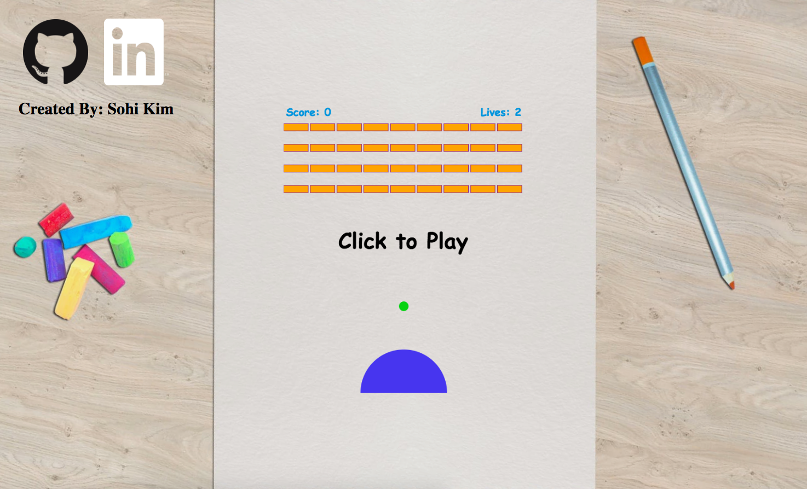

# Breakout on a Curve

[Breakout on a Curve](https://curved-breakout.herokuapp.com) is a twist to the old classic Breakout game with a semicircular paddle.



## Gameplay
The goal of Breakout on a Curve is to clear all the bricks while keeping the ball from hitting the bottom of the game screen before running out of lives.

The player can control the movement of the paddle by moving the mouse left and right.  With the semicircular paddle, as opposed to a regular, rectangular paddle, the angle of the incoming ball and its point of contact with the paddle together determine the direction of the ball after collision with the paddle.  Thus, the player can utilize the circular surface of the paddle to gain a greater control of the ball's movement.

## Features
### Semicircular Paddle Reflection Logic

```javascript
    const distX = ball.x - paddle.x;
    const distY = ball.y - paddle.y;
    const dx = ball.dx;
    const dy = -1 * ball.dy;

    let dxNew = ((-1 / Math.pow(dist, 2)) * ((Math.pow(distX, 2) - Math.pow(distY, 2)) * dx - (2 * distX * distY * dy)));
    let dyNew = ((1 / Math.pow(dist, 2)) * ((Math.pow(distY, 2) - Math.pow(distX, 2)) * dy - (2 * distX * distY * dx)));
```

### Adjustment for Better Gameplay
Below a certain point on the paddle, there is a greater possibility for the ball to to reflect downwards, and it would be very difficult for the paddle to save the ball before the ball hits the bottom of the game screen, rendering an immediate life loss.  Thus, to prevent that from happening, players tend to play safe and stick to using only the top portion of the paddle.  This renders the rest of the paddle to be unplayable.  Therefore, the reflection logic was adjusted so that the reflected direction of the ball upon paddle collision is guaranteed to be upwards by reflecting the reflected downwards vector over the horizontal axis.  Resultingly, players can feel free to use all parts of the paddle.

```javascript
    dyNew = this.dyRequirePositive(ball, originalY, dyNew);
```

```javascript
    dyRequirePositive(ball, originalY, dyNew) {
    while (dyNew + ball.y >= originalY) {
      if (dyNew > 0) {
        dyNew *= -1;
      }
    }

    return dyNew;
    }
```
